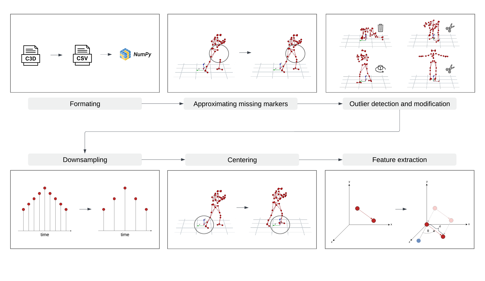

# MoDiffAE - Motion Diffusion Autoencoder (Work in progress)


<p float="left">
  
   
  
</p>

<p float="left">
  
   
  
</p>

This is the official repository of MoDiffAE, the first sequence-to-sequence model capable of modifying arbitrary arbitrary human motion characteristics. Below you will find an overview of the MoDiffAE architecture. It is based on Diffusion Models and Transformers.


Although its capabilities are demonstrated on human motion, the model could in theory be used for the modification of any type of sequence data. However, it has not been tested on other types of sequence data, yet.


## Preprocessing 

Before training, the data was preprocessed in multiple steps. An overview of the pipeline in shown below. All these steps as well as all results are completely reproducable. You can download the raw as well as the preprocessed data from my [cloud](https://e.pcloud.link/publink/show?code=kZFusjZ5d1c0YIA6Xp0gEYKxQdzdFIJSGT7). If you do not want to change the preprocessing, I would recommend the preprocessed data set. If you want to reproduce or adjust the preprocessing, use the raw data set and execute the preprocessing pipeline by running the following command: 

```bash
bash preprocessing/karate/preprocess.sh
```
This will automatically perform all preprocessing steps and create splits for training, validation and testing.




