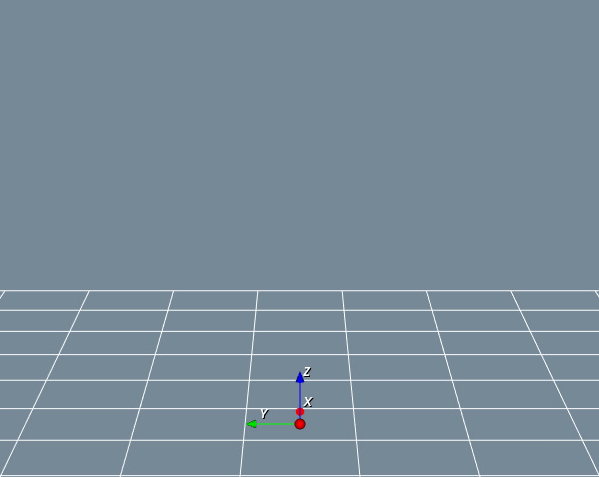
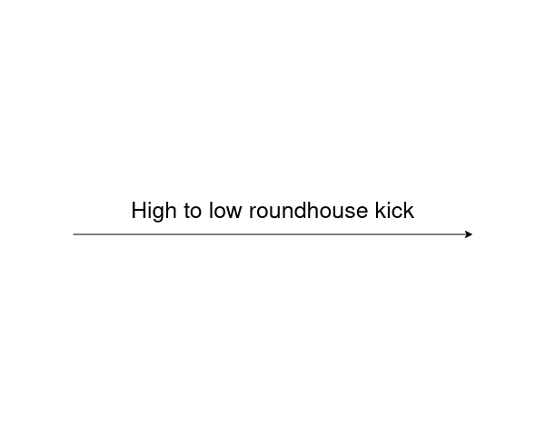
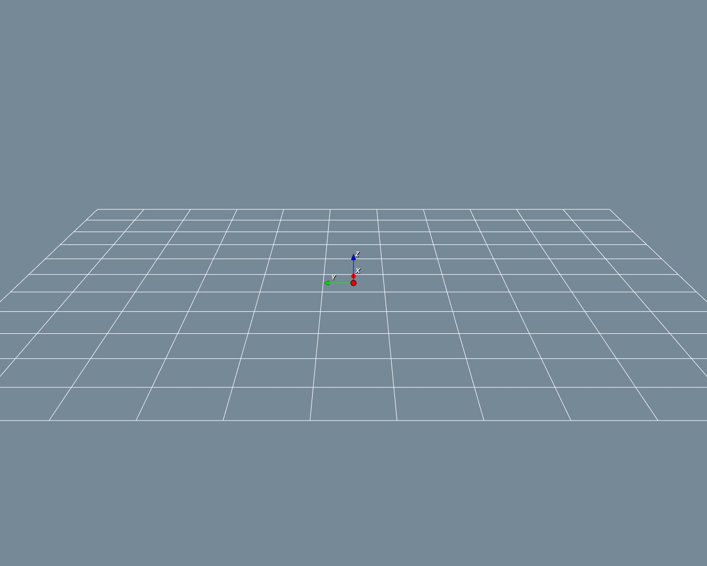
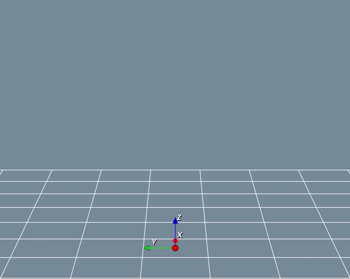
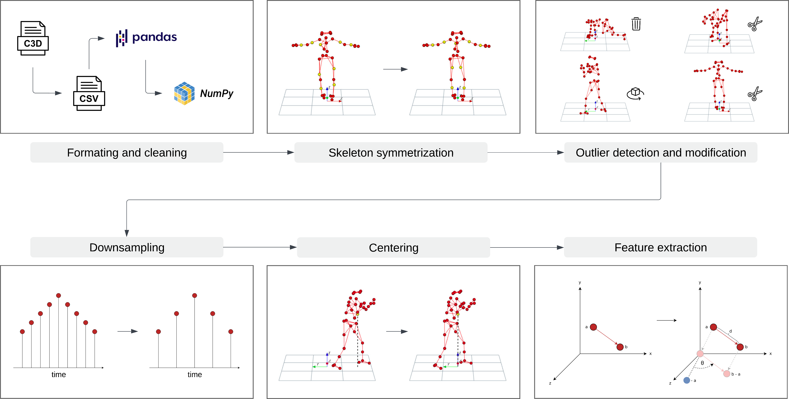

# MoDiffAE - Motion Diffusion Autoencoder

<p float="left">
  
   
  
</p>

<p float="left">
  
   
  
</p>

This is the official repository of MoDiffAE, the first sequence-to-sequence model capable of modifying arbitrary human motion characteristics. Below you will find an overview of the MoDiffAE architecture. It is based on Diffusion Models and Transformers. Although its capabilities are demonstrated on human motion, the model could in theory be used for the modification of any type of sequence data. However, it has not been tested on other types of sequence data, yet. A detailed explanation of the system is given [here](https://e.pcloud.link/publink/show?code=kZVXG1ZQ8IxVVWQGb7CnzRPFy9aFSLyf2e7). 


## Setutp
First, setup and activate a conda environment:
```bash
conda env create -f environment.yml
conda activate modiffae
```

## Preprocessing 

Before training, the data was preprocessed in multiple steps. An overview of the pipeline is shown below. All these steps as well as all results are completely reproducable. You can download the raw as well as the preprocessed data from my [cloud](https://e.pcloud.link/publink/show?code=kZFusjZ5d1c0YIA6Xp0gEYKxQdzdFIJSGT7). If you do not want to change the preprocessing, I would recommend the preprocessed data set. If you want to reproduce or adjust the preprocessing, use the raw data set and execute the preprocessing pipeline by running the following command: 

```bash
bash preprocessing/karate/preprocess.sh
```
This will automatically perform all preprocessing steps and create splits for training, validation and testing.



## Prerequisites
Training and evaluation is possible using a single RTX 2080 Ti.
Moreover, all scripts provide a variety of further parameters that can be specified. 
For an explanation of all paratemerts of a specific script, run
```bash
python -m {path_to_script} --help
```
In the case of the training script, the model_type for which to receive information must also be specified.

## Training
There are three models that can be trained. The MoDiffAE core, the semantic regressor and the semantic generator. 
The core needs to be trained first as the other to models depend on it. 
When training the regressor and generator, the core is frozen. 

### Core 
```bash
python -m training.train --model_type modiffae --save_dir {path_to_save_dir} --test_participant {test_participant} --pose_rep {pose_representation}
```

### Regressor 
```bash
python -m training.train --model_type semantic_regressor --modiffae_model_path {path_to_modiffae_core_model}
```

### Generator (experimental)
```bash
python -m training.train --model_type semantic_generator --modiffae_model_path {path_to_modiffae_core_model}
```

## Model Evaluation

### Core 
To evaluate the linear separability in the semantic embedding space for all model checkpoints, run
```bash
python -m evaluation.semantic_embedding_knn_regression --save_dir {path_to_save_dir}
```
To visualize the structure of the semantic embedding for a specific model checkpoint, run
```bash
python -m evaluation.visualize_semantic_embedding --modiffae_model_path {path_to_modiffae_core_model}
```

### Regressor 
To evaluate the performance of the semantic regressor for all model checkpoints, run
```bash
python -m evaluation.semantic_regressor_eval --modiffae_model_path {path_to_modiffae_core_model} --save_dir {path_to_save_dir}
```

### Generator (experimental)
To evaluate the performance of the semantic generator for all model checkpoints, run
```bash
python -m evaluation.generation_fid --modiffae_model_path {path_to_modiffae_core_model}
```

## Manipulation Evaluation
The evaluation of the manipulation consists of a qualitative evaluation, which needs to be done first, and a quantitative evaluation. 
### Qualitative 
The qualitative evaluation executes all test manipulations and saves the results in numpy files. 
This is done by running 
```bash
python -m evaluation.manipulation_qualitative_eval --modiffae_model_path {path_to_modiffae_core_model} --semantic_regressor_model_path {path_to_regressor_model}
```
To create visualizations for all of the resuling test manipulations, run
```bash
python -m evaluation.create_collages_for_test_manipulations
```

### Quantitative
To quantify the manipulation performance based on the previously created test manipulations, run
```bash
python -m evaluation.manipulation_fid --modiffae_model_path {path_to_modiffae_core_model} --semantic_regressor_model_path {path_to_regressor_model}
```
The type of manipulation that should be evaluated has to be set in the according script.

## Data generation (experimental)
Assuming a semantic generator was trained, the system can also be used to generate new data. This can be done by running
```bash
python -m sample.rejection_generation --modiffae_model_path {path_to_modiffae_core_model} --semantic_generator_model_path {path_to_generator_model} --semantic_regressor_model_path {path_to_regressor_model}
```

### Acknowledgements
This code is based on a variety of other works. We want to thank the following contributors that our code is based on:

[MDM](https://github.com/GuyTevet/motion-diffusion-model/tree/main), [guided-diffusion](https://github.com/openai/guided-diffusion), [PyMoCapViewer](https://github.com/justamad/PyMoCapViewer). 

### License
This code is distributed under an [MIT LICENSE](LICENSE).

